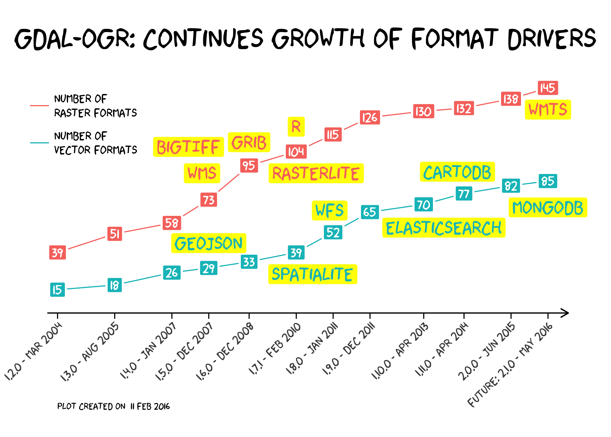

One of the features which makes GDAL/OGR so powerful is the enormous amount of supported formats. This R script is counting the number of rows of the GDAL's and OGR's format lists per version to illustrate the continuous growth of format drivers. The resulting time-series is getting enriched with some of my personal favorites, which are:
- GeoJSON
- BigTiff
- Web Map Service (WMS)
- Grib/Grib2 (GRIdded Binary)
- R
- RasterLite and SpatiaLite
- Web Feature Service (WFS)
- ElasticSearch
- CartoDB
- Web Map Tile Service (WMTS)
- MongoDB

**After all, the hard working developers are introducing 8.2 new raster formats and 5.4 new vector formats per version.** While one version per year is getting released - which is a clear statement!!!

### Sources

1. GDAL/OGR source code from [http://download.osgeo.org/gdal/](http://download.osgeo.org/gdal/)
    * gdal formats in [version]/frmts/formats_list.html
    * ogr formats in [version]/ogr/ogrsf_frmts/ogr_formats.html
    * news in [version]/NEWS
2. GDAL 2.1 release plans from [http://lists.osgeo.org/pipermail/gdal-dev/2016-January/043453.html](http://lists.osgeo.org/pipermail/gdal-dev/2016-January/043453.html)

### Remarks

* Version 1.1.0 doesn't contain this format lists so version 1.2.0 is the first one
* Version 1.7.0 was retracted because of a critical bug so version 1.7.1 was used
* Some formats are read only.
* XKCD font doesn't support brackets or colons ;)